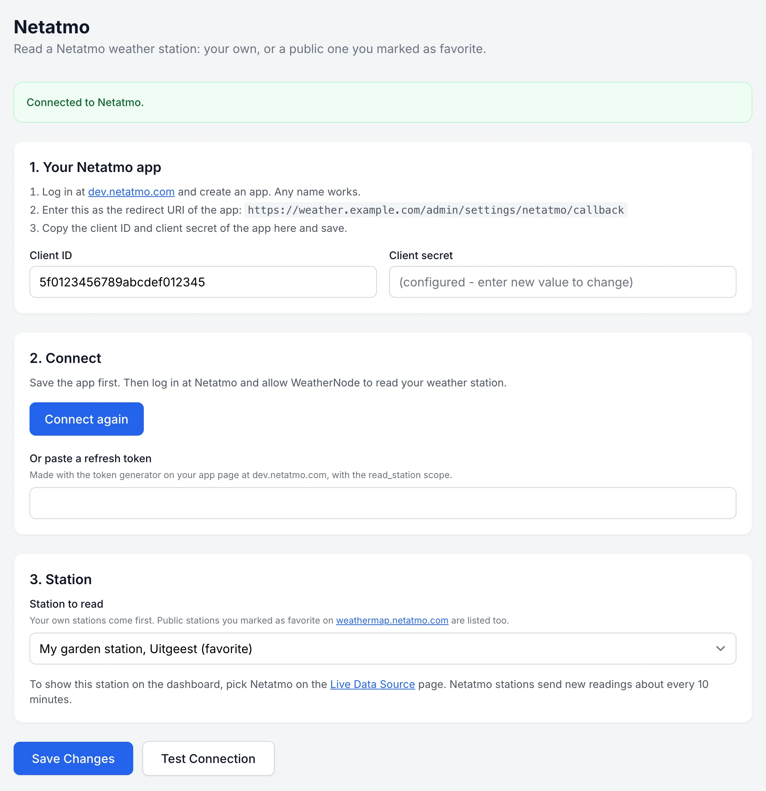

# Connect a Netatmo station

WeatherNode can read a Netatmo weather station. That can be your own station, or a public station you marked as favorite on the Netatmo weather map. So you can use WeatherNode even without your own hardware.

Netatmo stations send new readings about every 10 minutes, so the dashboard updates that often.

## Step 1: Create a Netatmo app

Netatmo only lets apps read station data, so you make a free app of your own.

1. In WeatherNode, open **Settings, Netatmo**. Copy the redirect URI shown under **1. Your Netatmo app**. It ends in `/admin/settings/netatmo/callback`.
2. Log in at [dev.netatmo.com](https://dev.netatmo.com/apps/) and create an app. Any name works.
3. Paste the redirect URI into the app's redirect URI field and save the app.
4. Copy the app's **client ID** and **client secret** into WeatherNode and click **Save Changes**.

## Step 2: Connect

Click **Connect Netatmo**. Log in at Netatmo and allow access. You come back to WeatherNode, and the page says **Connected to Netatmo**.

If that doesn't work, use the token generator on your app page at dev.netatmo.com instead. Pick the `read_station` scope, generate a token, and paste the **refresh token** into **Or paste a refresh token** in WeatherNode. Then save.

## Step 3: Pick a station

Under **3. Station**, pick the station to read. Your own stations come first.

To use a public station, open [weathermap.netatmo.com](https://weathermap.netatmo.com), log in, and mark the station as favorite. It then shows up in the list. Public stations only share outdoor readings, so there is no indoor temperature or CO2.

Click **Save Changes**, then **Test Connection**.

## Step 4: Show it on the dashboard

Go to **Live Data Source**, set **Primary Live Data Source** to **Netatmo** and save.

## What WeatherNode reads

- Outdoor module: temperature and humidity
- Base station: pressure, indoor temperature, indoor humidity and CO2
- Wind gauge: wind speed, gust, direction and the highest gust today
- Rain gauge: rain in the last hour and rain today
- Extra indoor modules: as extra temperature and humidity channels

Netatmo has no rain rate, so that stays empty.

## If something is wrong

**The page shows "Last error".** WeatherNode keeps the last thing Netatmo said. `invalid_grant` means the login expired or was taken back. Click **Connect again**.

**Connect sends you to an error page at Netatmo.** The redirect URI in your Netatmo app must match the one WeatherNode shows exactly, including `http` or `https`.

**No stations in the list.** You have no station of your own and no favorites yet. Mark a public station as favorite on the weather map, then reload the page.
