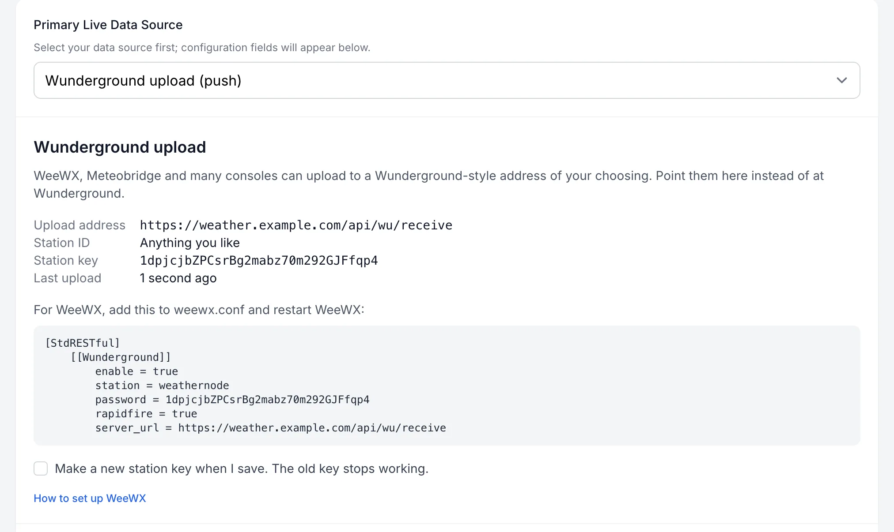
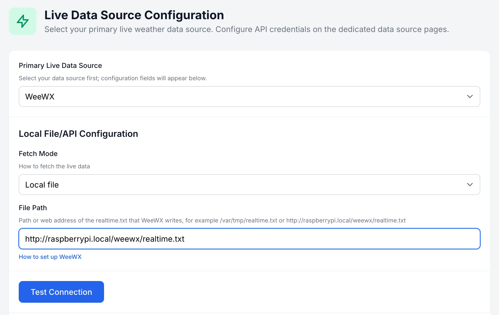

# Connect more stations with WeeWX

Is your weather station not on the WeatherNode list? WeeWX can probably connect it.

[WeeWX](https://weewx.com) is free software that runs on a small computer next to your station, often a Raspberry Pi. It reads your station over USB, serial or radio. It works with more than 70 station models from brands like AcuRite, Davis, Fine Offset, LaCrosse, Oregon Scientific, Peet Bros, RainWise, Hideki and Vaisala. See the [full list](https://weewx.com/hardware.html).

There are two ways to get WeeWX readings into WeatherNode:

- **Upload (easiest).** WeeWX sends its readings to WeatherNode. You don't need to install anything extra, and it works wherever WeatherNode runs, as long as the WeeWX computer can reach it. WeatherNode saves a reading about once a minute.
- **File.** WeeWX writes a small file called `realtime.txt`, and WeatherNode reads it every minute. Use this if WeatherNode can reach the WeeWX computer but not the other way round.

## Step 1: Install WeeWX

Follow the quick start for your system in the [WeeWX docs](https://weewx.com/docs). Make sure WeeWX shows readings from your station before you go on.

You will edit `weewx.conf` in the next steps. You can find it here:

- Installed with `apt`: `/etc/weewx/weewx.conf`
- Installed with `pip`: `~/weewx-data/weewx.conf`

## Way 1: Upload

WeeWX can upload to Weather Underground. You point that upload at WeatherNode instead.

1. In the WeatherNode admin panel, go to **Live Data Source**.
2. Set **Primary Live Data Source** to **Wunderground upload (push)** and click **Save Changes**. WeatherNode makes a station key and shows the upload address, the key and the settings for WeeWX.
3. In `weewx.conf`, find the `[[Wunderground]]` part under `[StdRESTful]`. Change it to the settings WeatherNode shows. They look like this:

   ```ini
   [StdRESTful]
       [[Wunderground]]
           enable = true
           station = weathernode
           password = <your station key>
           rapidfire = true
           server_url = https://<your WeatherNode>/api/wu/receive
   ```

4. Restart WeeWX:

   ```sh
   sudo systemctl restart weewx
   ```

5. Back on the **Live Data Source** page, **Last upload** should now show a time. **Test Connection** checks the same thing.



Good to know:

- WeeWX has only one Weather Underground upload, so this replaces uploads to the real Weather Underground.
- With `rapidfire = true`, WeeWX sends every few seconds. WeatherNode answers them all and saves one reading a minute. Without it, WeeWX sends once every archive period, which is 5 minutes by default.
- If a station key gets out, tick **Make a new station key when I save** and put the new key in `weewx.conf`.

**Other devices.** Meteobridge and many consoles can also upload to a Wunderground-style address. Use the upload address from WeatherNode as the server, anything as the station ID, and the station key as the password or key.

## Way 2: File

### Install the crt extension

Run this on the computer that runs WeeWX:

```sh
weectl extension install https://github.com/matthewwall/weewx-crt/archive/master.zip
```

If you installed WeeWX with `apt`, put `sudo` in front.

crt needs `distutils`, which Python 3.12 and newer no longer include. If WeeWX stops with `No module named 'distutils'`, install setuptools, which brings it back:

- Installed with `apt`: `sudo apt install python3-setuptools`
- Installed with `pip`: run `pip install setuptools` in the same Python environment as WeeWX

### Choose where the file goes

Look for the `[CumulusRealTime]` section in `weewx.conf`. Pick the option that fits your setup.

**A. WeatherNode runs on the same computer.** Keep the default:

```ini
[CumulusRealTime]
    filename = /var/tmp/realtime.txt
```

In WeatherNode, the file path is `/var/tmp/realtime.txt`.

**B. WeatherNode runs on another computer in your home.** Write the file into the WeeWX web folder:

```ini
[CumulusRealTime]
    filename = /var/www/html/weewx/realtime.txt
```

The computer running WeeWX needs a web server for this, such as nginx (`sudo apt install nginx`). See [WeeWX web server setup](https://weewx.com/docs/5.2/usersguide/webserver/).

In WeatherNode, the file path is `http://<your-pi>/weewx/realtime.txt`. Replace `<your-pi>` with the name or IP address of the computer running WeeWX, for example `http://raspberrypi.local/weewx/realtime.txt`.

**C. WeatherNode runs online.** Use Way 1 instead. It is simpler and updates every minute.

Restart WeeWX (`sudo systemctl restart weewx`). Open the file, or the web address in your browser. You should see one line of numbers that changes every few seconds.

### Set up WeatherNode

1. In the admin panel, go to **Live Data Source**.
2. Set **Primary Live Data Source** to **WeeWX**.
3. Set **Fetch Mode** to **Local file**.
4. Fill in **File Path** with the path or web address from above.
5. Click **Save Changes**.
6. Click **Test Connection**. It tests the saved settings, so save first.



You don't need to set any units. WeatherNode reads the units from the file and converts them for you.

## If something is wrong

**Upload: Last upload stays empty.** Check the WeeWX log. `ERROR: wrong station key` means the password in `weewx.conf` doesn't match the key in WeatherNode. If there are connection errors, open the upload address in a browser on the WeeWX computer.

**File: many values are missing.** Some station drivers send only part of the readings each time. Add `binding = archive` to `[CumulusRealTime]` and restart WeeWX. The file then updates once every archive period instead of every few seconds.

**File: average wind, gust or wind direction is missing.** WeeWX needs an archive period of 5 minutes or less to work these out. In `[StdArchive]`, set `archive_interval = 300`.

**File: there is no file.** The user that runs WeeWX must be allowed to write to the folder. Check the WeeWX log for errors from `crt`.

**File: Test Connection fails with a web address.** Open the address in a browser on the computer that runs WeatherNode. If it doesn't load there, WeatherNode can't load it either.
